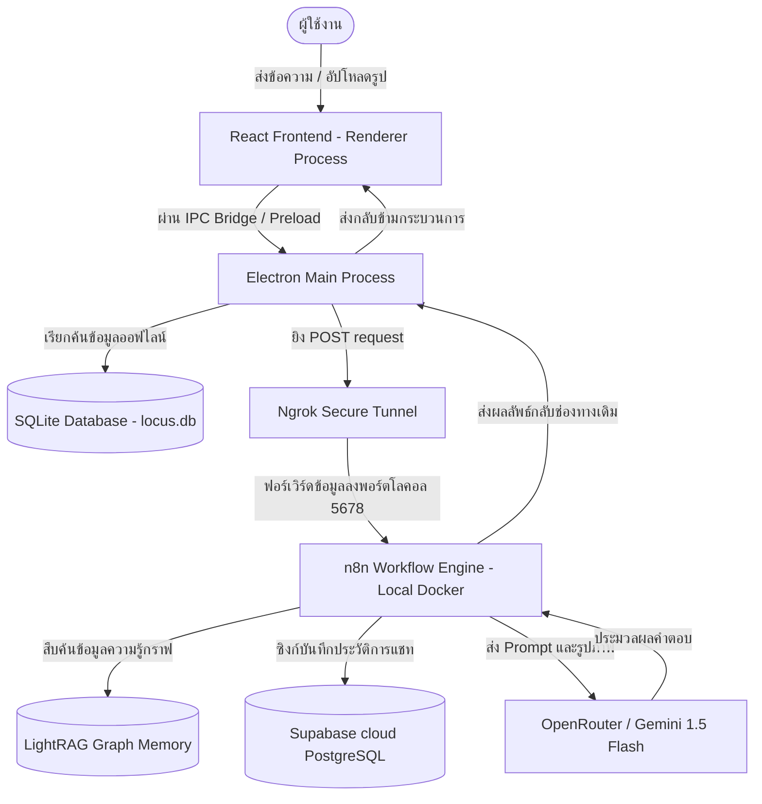

# 🗺️ Locus - Agentic AI for Geospatial Intelligence and Situational Awareness

### 👨‍💻 พัฒนาโดย: Zeroz (CPE311 AI Lab)

---

## 📌 ภาพรวมโครงการ (Project Overview)
**Locus** คือระบบเอเจนต์อัจฉริยะ (Intelligent Agent System) ที่ออกแบบมาเพื่อการวิเคราะห์พิกัดสถานที่ในรูปแบบเรียลไทม์, ตรวจสอบบริบททางประวัติศาสตร์, และประเมินความปลอดภัยเชิงยุทธวิธี โดยบูรณาการเทคโนโลยี Computer Vision ร่วมกับข้อมูลภูมิสารสนเทศ (Geospatial Data) เพื่อช่วยให้ผู้ใช้เข้าใจสภาพแวดล้อมรอบตัว ประเมินความเสี่ยงในการเดินทาง และค้นพบแหล่งข้อมูลทางวัฒนธรรมได้อย่างมีประสิทธิภาพ

โครงการนี้พัฒนาขึ้นภายใต้แนวคิด **"Local-First, Cloud-Sync"** สถาปัตยกรรมแบบประมวลผลโลคอลเป็นหลักเพื่อให้ทำงานได้รวดเร็วแบบออฟไลน์ และเชื่อมต่อกับคลาวด์สำหรับการประสานงานของเอเจนต์เมื่อมีอินเทอร์เน็ต

---

## 🚀 เทคโนโลยีหลัก (Tech Stack)

### Frontend & UI
*   **Core:** React 18, TypeScript, Vite
*   **Styling:** TailwindCSS
*   **Desktop App:** Electron (บริหารจัดการผ่าน `electron-vite`)
*   **UI Component:** Storybook (พัฒนา component แบบแยกส่วนและแยกทดสอบอิสระ)
*   **State Management:** React Hooks + Zustand

### Backend & Database (Hybrid)
*   **Local Database:** SQLite (ผ่าน `better-sqlite3` เปิดโหมด WAL) สำหรับเก็บแคชและข้อมูลออฟไลน์ความเร็วสูง เช่น ข้อมูลจังหวัด/ภูมิภาค
*   **Cloud Database:** Supabase (PostgreSQL) สำหรับเก็บประวัติการสนทนา โครงสร้างข้อมูลที่เชื่อมโยงกัน และการซิงก์ข้อมูลข้ามระบบ
*   **Agent Orchestrator:** n8n (รันภายใน Docker Container บนเครื่องโลคอล)
*   **Knowledge Base:** LightRAG (ระบบสืบค้นข้อมูลกราฟความรู้แบบโลคอล)
*   **AI Model:** Gemini 1.5 Flash (Vision & Reasoning) ผ่าน OpenRouter สำหรับงานวิเคราะห์ภาพถ่ายพิกัดและประเมินสถานการณ์

---

## ⚙️ คุณลักษณะเด่น (Key Features)
1.  **Intent-Driven Workflow:** ออกแบบหน้าแรกแบบค้นหาความต้องการของลูกค้าเป็นตัวตั้ง (Landing Page พร้อมแบบสอบถามระบุเจตจำนง) แทนการเลือกเปิดดูข้อมูลตามหมวดหมู่แบบเดิม ๆ
2.  **Visual Location Identification:** ระบุพิกัดหรือภูมิภาคจากภาพถ่ายท่องเที่ยวโดยอัตโนมัติ ด้วยระบบวิเคราะห์ "เบาะแสเชิงพิกัด" ของโมเดล AI
3.  **Local-First Performance:** โหลดข้อมูลภูมิภาคและ 77 จังหวัดได้ในเสี้ยววินาทีผ่าน SQLite ที่ฝังตัวอยู่ภายในแอป
4.  **Tactical Navigation & Maps:** หน้าข้อมูลจังหวัดเชิงยุทธวิธีที่มาพร้อมแผนที่แผนที่ Leaflet รองรับการเปิด-ปิด Layer ข้อมูลต่าง ๆ เช่น สภาพการจราจร, ระดับฝุ่น AQI (GISTDA/AQICN), เรดาร์ฝน, แท่นชาร์จ EV, พื้นที่เสี่ยงน้ำท่วมซ้ำซาก, และความลาดชันของพื้นที่
5.  **Agent Chat Interface:** ระบบแชทอัจฉริยะที่เชื่อมต่อกับ LightRAG และ n8n สำหรับตอบคำถามเชิงลึกเกี่ยวกับภูมิภาค/จังหวัดนั้น ๆ
6.  **Live Weather & AQI Sync:** ระบบดึงข้อมูลสภาพอากาศและ AQI เรียลไทม์ ซิงก์ลง SQLite โดยมีกลไก Polling ทุก 10 วินาที
7.  **Province News Sync:** ดึงข่าวเด่นรอบจังหวัดจากเซิร์ฟเวอร์ News Aggregator แบบเรียลไทม์ และเก็บสำรองลง SQLite เมื่อออฟไลน์
8.  **Image Cache Protocol:** ลงทะเบียนโปรโตคอล `locus://image` เพื่อทำแคชภาพลงฮาร์ดดิสก์ขนาดสูงสุด 512MB รองรับการสตรีมภาพขนาดใหญ่และมีภาพทดแทนเมื่อลิงก์เสีย

---

## 🛠️ วิธีการติดตั้งและการเริ่มใช้งาน (Getting Started)

### ความต้องการของระบบ (Prerequisites)
*   Node.js (เวอร์ชัน 18 ขึ้นไป)
*   Docker Desktop (สำหรับรัน n8n และ LightRAG)
*   Ngrok (สำหรับเปิด Tunnel ให้คลาวด์ส่ง Webhook กลับมาเครื่องโลคอลได้)

### 1. ขั้นตอนการติดตั้ง
ติดตั้งไลบรารีที่จำเป็นทั้งหมดของโครงการ:
```bash
npm install
```

### 2. การสร้างและเติมข้อมูลลงฐานข้อมูลโลคอล (SQLite Database Setup)
เมื่อรันโปรเจกต์เป็นครั้งแรก ระบบจะสร้างไฟล์ฐานข้อมูล `locus.db` ขึ้นมาโดยอัตโนมัติพร้อมโครงสร้างข้อมูลเริ่มต้น หากต้องการดึงข้อมูลรูปภาพความละเอียดสูง เรตติ้งสถานที่ และข้อมูลเสริมอื่น ๆ จากอินเทอร์เน็ตด้วยระบบ Web Scraper (Playwright) ให้รันสคริปต์ด้านล่างนี้:

```bash
# ดึงข้อมูลเพิ่มเติมและบันทึกใส่ฐานข้อมูลเฉพาะแถวที่ข้อมูลยังไม่ครบ
npm run db:enrich

# บังคับดึงข้อมูลใหม่ทั้งหมดทุกแถวทับข้อมูลเดิม
npm run db:enrich:force
```

### 3. การเปิดใช้งานระบบในการพัฒนา (Development Scripts)
*   **รันแอปพลิเคชันหลัก (Electron + Vite):**
    ```bash
    npm run dev
    ```
*   **รัน Storybook (เพื่อเปิดดูและพัฒนา Component เดี่ยว):**
    ```bash
    npm run storybook
    ```
*   **การรันบริการ Backend & AI (n8n + Ngrok):**
    ให้รันสคริปต์สคริปต์นี้เพื่อเริ่มต้นระบบหลังบ้านจำลองทั้งหมดในครั้งเดียว:
    ```bash
    ./scripts/start_all.bat
    ```

---

## 🧭 หน้าของแอปพลิเคชันและการนำทาง (Application Routes)

| เส้นทาง (Route) | หน้าจอ | รายละเอียดการใช้งาน |
| :--- | :--- | :--- |
| `/` | Explore Hub | หน้าแรกสำหรับค้นหาความต้องการการเดินทางของระบบ (Guided Discovery) |
| `/map` | Threat Radar | แผนที่ประเทศไทยขนาดใหญ่ (Interactive) พร้อมสรุปข้อมูลรายภูมิภาค |
| `/province/:regionId/:provinceId` | Province Tactical | ข้อมูลจังหวัดเชิงลึกพร้อมแผนที่แผนที่ Leaflet และรายละเอียดการเดินทาง/ความปลอดภัย |
| `/travel-guide/:regionId` | Travel Guide | แหล่งรวบรวมระบบขนส่งมวลชน, การวางแผนเส้นทางเดินทาง, และระบบนิเวศน์ทางธรรมชาติ |
| `/intelligence` | Intelligence | หน้าแชทกับผู้ช่วย AI ที่สามารถจำแนกบริบทข้อมูลจังหวัดที่กำลังดูได้ทันที |
| `/analytics` | Analytics | บอร์ดแดชบอร์ดสรุปสถานการณ์ความเสี่ยงและข่าวสารภัยพิบัติ |
| `/settings` | Settings | หน้าตั้งค่าแอปพลิเคชัน เช่น Ngrok Tunnel URL, API Key, การเคลียร์แคชรูปภาพ |

---

## 📐 สถาปัตยกรรมและการไหลของข้อมูล (System Architecture)



### การไหลของข้อมูลแชท AI (Chat Tunneling)
1.  หน้าจอแชท (`IntelligencePage.tsx`) ส่งข้อความโดยไม่ได้ยิงหา n8n ตรงๆ แต่จะส่งผ่าน `window.api.n8n.chat(...)` ซึ่งเป็นสะพานเชื่อมต่อ IPC ของ Electron
2.  Electron กระบวนการหลัก (Main Process) ทำหน้าที่ส่ง HTTP Request ไปยัง URL ของ Ngrok ที่กำหนดไว้ในแอปพลิเคชัน
3.  Ngrok จะส่งคำขอดังกล่าวลอดอุโมงค์เครือข่ายเข้ามาที่พอร์ต `5678` ภายในเครื่องคอมพิวเตอร์ที่ n8n กำลังเปิดรับ Webhook อยู่
4.  n8n รับหน้าที่เรียกโมเดล AI นำเข้า Context และดึงความรู้ในฐานข้อมูล ก่อนจะตอบกลับในรูปแบบ JSON `{ "output": "..." }` ย้อนกลับสู่ฝั่ง Renderer

---

## 🎨 ระบบสีประจำภูมิภาค (Region Color System)
เพื่อความต่อเนื่องของประสบการณ์ผู้ใช้ แอปพลิเคชันใช้โครงสร้างชุดสีประจำภูมิภาคโดยมีสีแกนหลักและสีไล่ระดับ (Gradient Theme) อ้างอิงตามไฟล์ `src/shared/regionTheme.ts`:

| ภูมิภาค | ภาษาไทย | รหัสสีหลัก (Hex) | ชื่อสี Tailwind |
| :--- | :--- | :--- | :--- |
| **North** | ภาคเหนือ | `#a855f7` | violet |
| **Northeast** | ภาคอีสาน | `#ef4444` | red |
| **Central** | ภาคกลาง | `#f97316` | orange |
| **West** | ภาคตะวันตก | `#22c55e` | emerald |
| **East** | ภาคตะวันออก | `#facc15` | yellow |
| **South** | ภาคใต้ | `#2563eb` | blue |

---

## 📁 โครงสร้างโฟลเดอร์โครงการที่สำคัญ (Directory Layout)
```text
locus/
├── .storybook/              # ตั้งค่า Storybook
├── documents/               # เอกสารรายละเอียดระบบเชิงลึก (Architecture, Data Logs, ฯลฯ)
├── resources/               # ทรัพยากรแอปพลิเคชันคงที่ (เช่น ไอคอนแอป)
├── scripts/                 # สคริปต์สแกรรปเปอร์ดึงข้อมูล และไฟล์แบทช์รันหลังบ้าน
├── src/
│   ├── main/                # กระบวนการหลักของ Electron (สิทธิ์เข้าถึง OS, ฐานข้อมูล SQLite)
│   ├── preload/             # สคริปต์เชื่อมโยง IPC Bridge ความปลอดภัยสูง
│   ├── renderer/            # React App ฝั่งหน้ากากแอปพลิเคชัน (UI, หน้าจอ, คอมโพเนนต์)
│   └── shared/              # ชุดประเภทข้อมูล (Types) และค่าคงที่ที่ใช้ร่วมกันของ Main/Renderer
├── electron.vite.config.ts  # ไฟล์ตั้งค่า Electron-Vite
└── package.json             # ไฟล์ควบคุมเวอร์ชันของ Library และคำสั่งรันแอป
```
